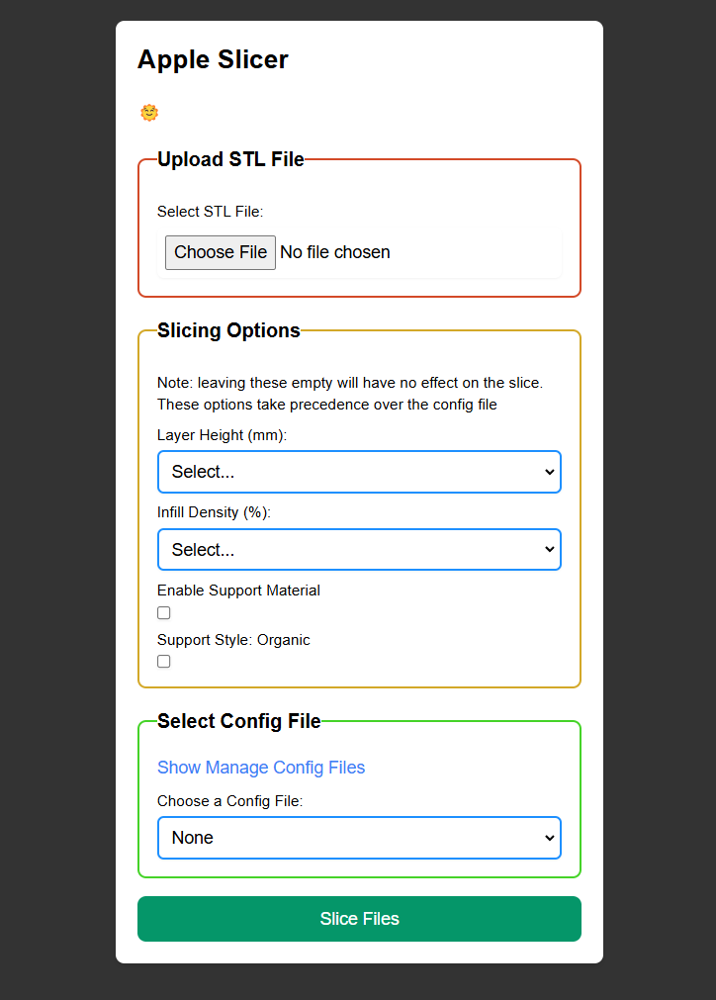

# AppleSlicer
## A text-based web slicer based off Prusa Slicer CLI

Built using flask, html, python logic, and hopes+dreams

### Main Interface:

To use:
git clone https://github.com/eastoncrafter/appleslicer
edit docker compose with continuous print settings, and octoprint api key and all that jazz (api key may not work everywhere yet check into that future me)
docker compose up -d